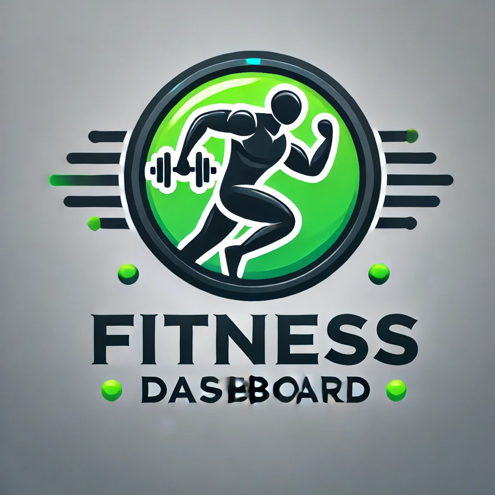

# Fitness App Dashboard



## Table of Contents
- [Project Overview](#project-overview)
- [Technologies Used](#technologies-used)
- [Features](#features)
- [Frontend](#frontend)
- [Backend](#backend)
- [Installation](#installation)
- [License](#license)
- [Screenshots](#screenshots)

## Project Overview

The **Fitness App Dashboard** is a web application for managing clients' fitness data. It consists of two main dashboards: one for **trainers** and one for **clients**. Trainers can assign clients, track progress, and communicate with clients. Clients can view their fitness progress, interact with trainers, and chat in real-time.

### Key Features:
- **Trainer Dashboard**: View and manage assigned clients and chat with them.
- **Client Dashboard**: Track fitness progress and interact with trainers.
- **Real-time Chat**: Instant messaging between clients and trainers.
- **Responsive Design**: Works seamlessly on both desktop and mobile.

## Technologies Used

### Frontend:
- **React** for building the user interface.
- **Next.js** for server-side rendering and API routes.
- **Tailwind CSS** for styling and responsive design.
- **TypeScript** for type safety and better developer experience.

### Backend:
- **PostgreSQL** for the database.
- **Drizzle ORM** for querying the database.
- **Next.js API Routes** for server-side logic and API handling.

## Features

✨ **Trainer Dashboard**:  
View and manage assigned clients, track progress, and chat with them in real-time.

✨ **Client Dashboard**:  
View personal fitness data, track progress, and interact with assigned trainers.

💬 **Real-time Chat**:  
Instant communication between clients and trainers for better support and guidance.

## Screenshots

### Trainer Dashboard

 <!-- Add actual path to your image -->

### Client Dashboard

 <!-- Add actual path to your image -->

## Installation

To get started with this project, follow the steps below:

1. **Clone the repository:**
    ```bash
    git clone https://github.com/swederus/fitness-app.git
    ```

2. **Navigate to the project directory:**
    ```bash
    cd fitness-app
    ```

3. **Install dependencies:**
    ```bash
    npm install
    ```

4. **Start the application:**
    ```bash
    npm run dev
    ```

   The app will be available at [http://localhost:3000](http://localhost:3000).

## License

This project is licensed under the MIT License.

---

✨ **Feel free to contribute or raise an issue if you encounter any bugs. Happy coding!** ✨
